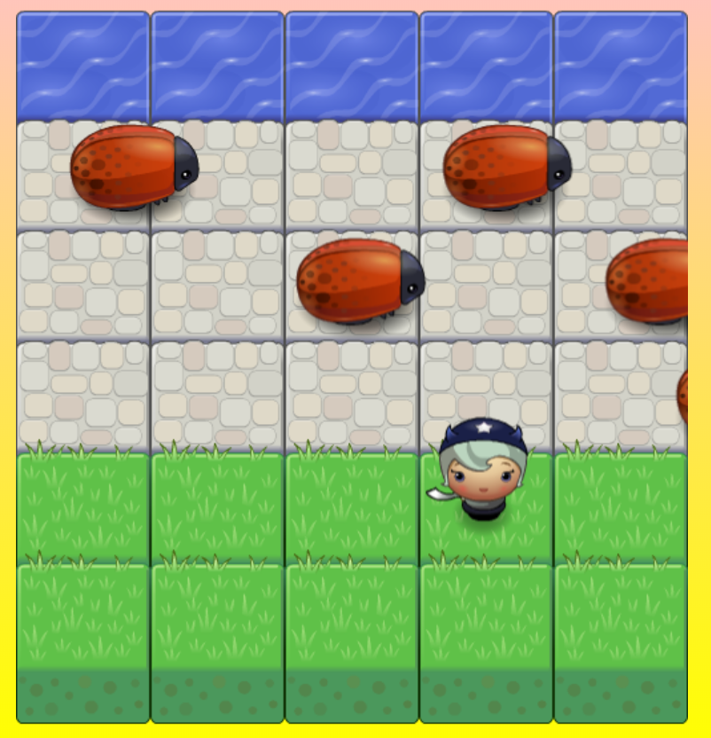

frontend-nanodegree-arcade-game
===============================

This project was done as a part of the Udacity Front-End Web Developer Nanodegree Program.
The starter file for this project is located at https://github.com/udacity/frontend-nanodegree-arcade-game .

Installation
---
To download this game,
1) Click the Clone or Download button then Download Zip.
2) Once downloaded, open the file and click on the index.html file to open the game on your browser.

How to play
---
The aim of the game is to move your avatar to the other end of the board where the water is. Avoid hitting the bugs that are crawling across the board as this will send you back to the starting position.

controls:
Use the arrow key to move your avatar across the board.

Good luck and have fun!
